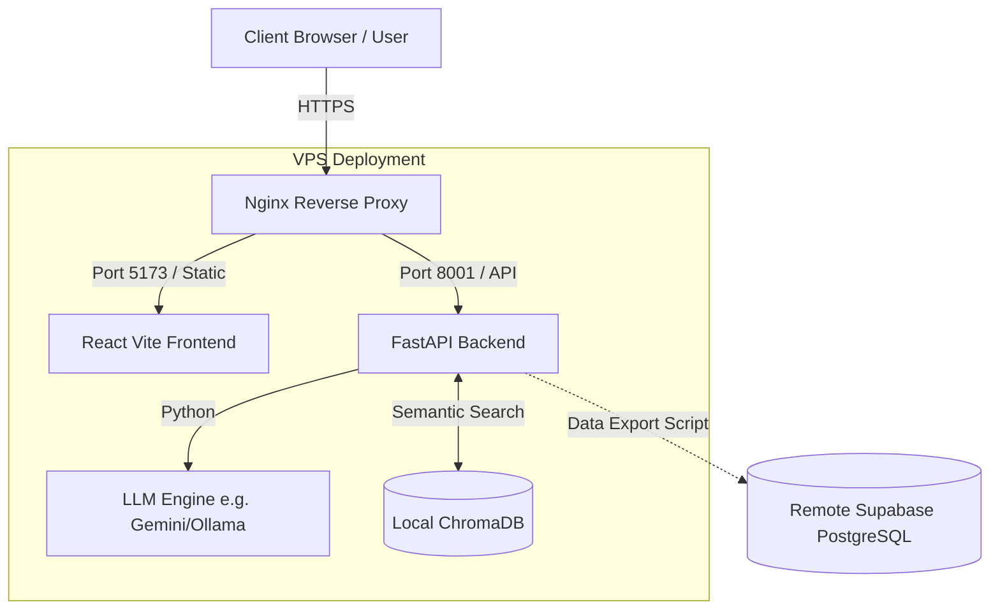
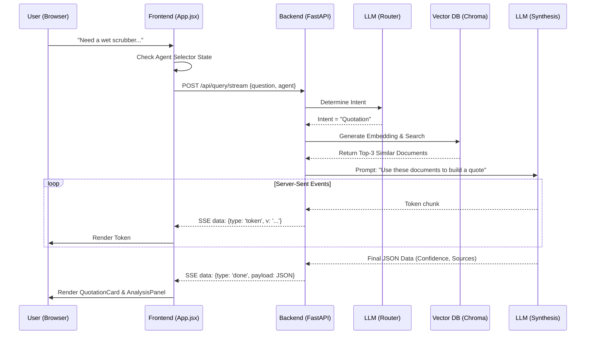

# ATS Engineering Assistant — Developer Handbook

This comprehensive handbook details the entire system architecture, workflows, diagrams, and codebase structure of the ATS Engineering Assistant.

---

## 1. System Architecture & VPS Deployment

The system is designed to run on a Virtual Private Server (VPS) using Nginx as a reverse proxy to route traffic between the static frontend and the FastAPI backend, while securely managing the local ChromaDB memory.



---

## 2. Tech Stack

- **Frontend:** React 18, Vite, Vanilla CSS (Dark Mode/Glassmorphism).
- **Backend:** Python 3, FastAPI, Uvicorn, Pydantic (Data validation).
- **Vector Storage (Active Brain):** ChromaDB (Local SQLite/embedded).
- **Relational Storage (Cold Storage):** Supabase (PostgreSQL).
- **LLM Integrations:** Support for Gemini 1.5 Pro, Ollama (Llama 3.1), configurable via routing.
- **Remote Access (Dev):** ngrok for live previewing.

---

## 3. Folder Structure

```text
generative ai/
├── frontend/
│   ├── src/
│   │   ├── App.jsx          # Monolithic React logic, SSE parsing, Agent Selector
│   │   └── styles.css       # Premium Dark Mode & Glassmorphic variables
│   ├── vite.config.js       # Configured with proxy & allowedHosts for ngrok
│   └── package.json         
│
├── backend/
│   ├── app/                 # FastAPI routes and LLM logic
│   │   └── main.py          # Uvicorn entry point
│   ├── chroma_store/        # Local SQLite database for Vector Embeddings
│   ├── data/                # Raw PDFs and extracted text for RAG
│   ├── scripts/
│   │   └── export_to_supabase.py  # Pipeline script to push vectors to the cloud
│   └── .env                 # API Keys (OpenAI, Gemini, Supabase)
│
├── docs/                    # Legacy HTML architecture notes
└── DATA_GUIDE.md            # Notes on data ingestion
```

---

## 4. Workflows & LLM Flows

### Search, Prompt, and Retrieval Flow
This sequence diagram illustrates exactly what happens when a user types a prompt into the UI.



---

## 5. Backend Flow & APIs

The backend is built around a hybrid routing mechanism.

**Core Endpoints:**
- `POST /api/query/stream`: The primary chat endpoint. Receives `{ question, session_id, agent }`. Returns a stream of SSE text tokens, followed by a final JSON payload containing the structured quotation data and source citations.
- `GET /api/health`: Returns system status, loaded LLM model, and `documents_indexed` count.
- `POST /api/quotation/pdf`: Generates a downloadable PDF of the generated quote.

---

## 6. Database Schema

### ChromaDB (Local Semantic Storage)
Stores RAG chunks. Uses Cosine Similarity for retrieval.
- `id`: Unique chunk string.
- `embedding`: High-dimensional float vector.
- `metadatas`: `{ source_file: 'quote.pdf', type: 'historical_offer' }`
- `document`: Raw text chunk.

### Supabase (Cloud RDBMS Export)
Table: `extracted_documents`
```sql
CREATE TABLE extracted_documents (
    id UUID PRIMARY KEY,
    document_name TEXT NOT NULL,
    chunk_text TEXT NOT NULL,
    embedding vector(1536), -- Assuming OpenAI/Gemini dimensions
    metadata JSONB,
    created_at TIMESTAMP DEFAULT now()
);
```

---

## 7. UI Previews

Below is the design mockup that guided the recent Premium UI Overhaul and Agent Selector implementation.


---

## 8. Future Plans & Notes

- **Component Refactoring:** The frontend `App.jsx` currently handles SSE parsing, state, and UI rendering (monolith). Future iterations will split this into `/components` and `/hooks` (e.g., `useChatStream`).
- **Production Supabase Integration:** Currently, Supabase is used as an external backup/demonstration of data portability via `export_to_supabase.py`. Future plans include reading directly from Supabase via `pgvector` instead of local ChromaDB to allow scaling across multiple VPS instances.
- **Authentication:** Wrap the frontend in Supabase Auth to prevent unauthorized users from accessing the underlying RAG data.
